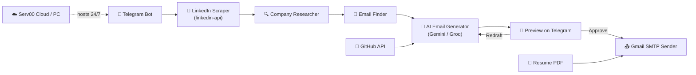

# LinkedIn Cold Outreach AI Agent (100% Free)

A Telegram-integrated AI agent that accepts LinkedIn post URLs, scrapes data, researches companies, finds contact emails, drafts customized precise cold emails referencing your GitHub portfolio and resume, and automatically sends them via Gmail SMTP upon approval—running 24/7 at **zero cost**.

---

## 📐 Architecture & Workflow



1. **Trigger**: You send a LinkedIn post URL to your Telegram bot.
2. **Extraction**: The bot scrapes the post content and author details (via `linkedin-api` Voyager endpoints or fallback HTML parsing).
3. **Research**: The company is researched using DuckDuckGo search + webpage parsing.
4. **Targeting**: The author's corporate email is found via scraping contact pages, Hunter.io, pattern guessing, and real-time SMTP validation.
5. **AI Drafting**: **Gemini 2.5 Flash** (with **Groq** fallback) reads your public GitHub repositories, parses your PDF resume, and generates a personalized cold email matching the post's context.
6. **Delivery**: You preview the email in Telegram. Click **Approve ✅** to send via Gmail SMTP with your resume attached, or **Redraft 🔄** to suggest edits.

---

## 🛠️ Tech Stack (All Free Tiers)

| Component | Technology | Cost / Free Limits |
|---|---|---|
| **Bot Interface** | Telegram Bot API + `python-telegram-bot` | Free, Unlimited |
| **LinkedIn Scraping** | `linkedin-api` (lightweight Voyager HTTP) | Free, No browser needed |
| **Company Research** | DuckDuckGo Search (`ddgs`) + `BeautifulSoup` | Free, Unlimited |
| **Email Finding** | Hunter.io API + Permutation guessing + SMTP check | 50 credits/mo + Unlimited guessing |
| **AI Generation** | Google Gemini API (`google-generativeai`) | ~1,500 requests/day |
| **Fallback LLM** | Groq API (`groq` Llama 3.3 70B) | Generous org-level limits |
| **Email Sending** | Gmail SMTP (standard SSL/TLS) | 500 recipients/day |
| **GitHub Reader** | GitHub REST API (`PyGithub`) | 5,000 requests/hour |
| **Hosting Server** | Serv00.com (Free BSD Shared Host) | $0/month, Always-on, SSH, no card |

---

## 📂 Project Structure

```
ai-cold-email-agent/
├── .env                          # API keys and credentials (ignored in git)
├── .env.example                  # Template for environment variables
├── .gitignore                    # Git file exclusions
├── requirements.txt              # Project library dependencies
├── main.py                       # Application entry point
├── config.py                     # Global prompts, configurations & tones
├── resume/
│   └── Atharv_Dhumone_Resume.pdf # Place your resume PDF here
├── agents/
│   ├── github_reader.py          # Fetches & summarizes your public repos
│   ├── linkedin_scraper.py       # Scrapes post content & author info
│   ├── company_researcher.py     # Gathers intelligence on target company
│   ├── email_finder.py           # Finds & verifies recipient email address
│   ├── email_generator.py        # Writes personalized drafts using LLMs
│   └── email_sender.py           # Sends emails via Gmail SMTP with resume
├── bot/
│   ├── telegram_bot.py           # Bot handlers and pipeline orchestra
│   └── callbacks.py              # Approve/Redraft feedback processors
├── deploy/
│   ├── setup_serv00.sh           # Deployment script for Serv00 cloud
│   ├── setup_windows.bat         # Background Windows service setup
│   └── setup_termux.sh           # Run on an old Android phone
└── utils/
    ├── logger.py                 # Structured logs logger
    └── helpers.py                # Regex helpers & PDF text parser
```

---

## 🚀 Setup & Local Installation

### 1. Clone & Set Up Virtual Environment
```bash
git clone https://github.com/12ATHARAV/ai-cold-email-agent.git
cd ai-cold-email-agent
python -m venv venv
```
*   **Windows:** `venv\Scripts\activate`
*   **Mac/Linux:** `source venv/bin/activate`

### 2. Install Dependencies
```bash
pip install -r requirements.txt
```

### 3. Add Your Resume
Create a folder named `resume` in the root directory (if not exists), place your resume PDF there, and rename it to:
`Atharv_Dhumone_Resume.pdf`

### 4. Configure Environment Variables
Copy `.env.example` to `.env` and fill in your keys:
```bash
cp .env.example .env
```
*   `TELEGRAM_BOT_TOKEN`: From [@BotFather](https://t.me/BotFather) on Telegram.
*   `GMAIL_APP_PASSWORD`: Generate a 16-character App Password from Google Account Security settings (requires 2FA enabled on Gmail).
*   `GEMINI_API_KEY`: Free key from [Google AI Studio](https://aistudio.google.com/apikey).
*   `LINKEDIN_LI_AT`: Log in to LinkedIn in Chrome → Press `F12` → Application tab → Cookies → Copy the value of the `li_at` cookie.

### 5. Run the Bot
```bash
python main.py
```
Send `/start` to your bot in Telegram!

---

## ☁️ 24/7 Cloud Deployment (No Credit Card)

This bot is designed to be extremely lightweight (under 50MB RAM), making it compatible with 100% free hosting providers that require **no credit card**.

### Option A: Serv00.com (Recommended Always-On Cloud)
1. Register a free account at [Serv00.com](https://serv00.com).
2. SSH into your server: `ssh username@sX.serv00.com`
3. Clone your repository, add `.env`, and run the deployment script:
   ```bash
   chmod +x deploy/setup_serv00.sh
   ./deploy/setup_serv00.sh
   ```
4. PM2 will run the bot in the background. Enable automatic resurrect on system reboot in your Serv00 panel cron settings using:
   `pm2 resurrect` (at reboot).

### Option B: Windows Background Service
To run the bot on your own PC silently in the background:
1. Run PowerShell as an Administrator.
2. Navigate to your project folder and run:
   ```powershell
   .\deploy\setup_windows.bat
   ```
This installer downloads `NSSM` and registers the bot as a background Windows service that auto-starts on system boot and auto-restarts on crash.

### Option C: Termux (Old Android Phone)
1. Install **Termux** from F-Droid (do not use Play Store).
2. Clone your repository and run:
   ```bash
   chmod +x deploy/setup_termux.sh
   ./deploy/setup_termux.sh
   ```

---

## 📱 Bot Commands

*   `/start` - Initialize bot and displays profile summary.
*   `/status` - Returns uptime, posts scraped, and emails sent statistics.
*   `/health` - Quick ping check confirming the bot is active.
*   `/cancel` - Aborts the current redrafting feedback conversation.
